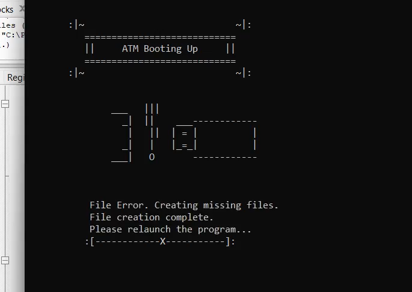
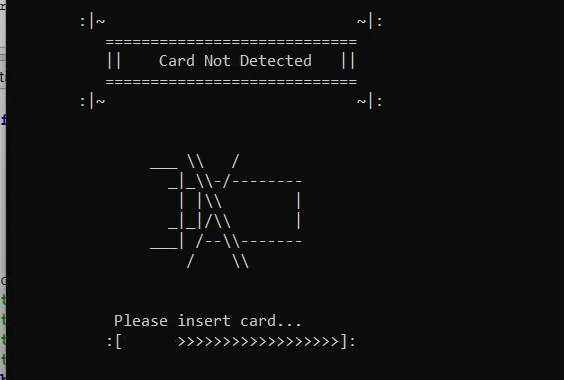
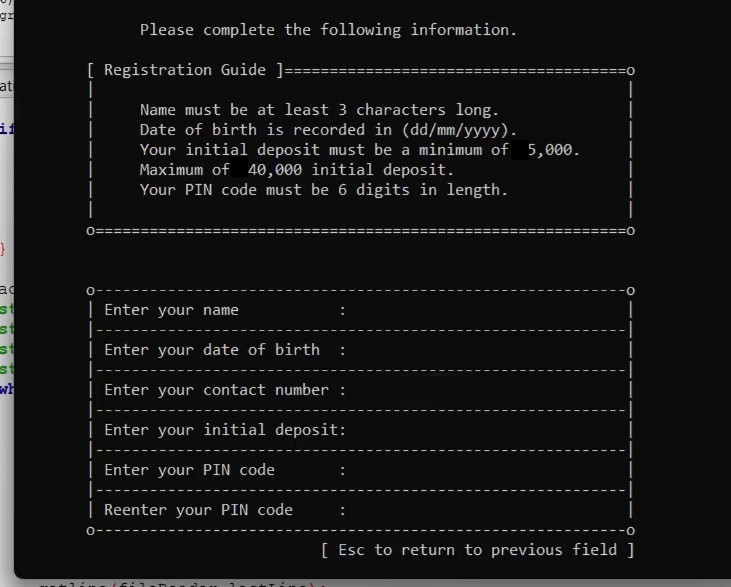
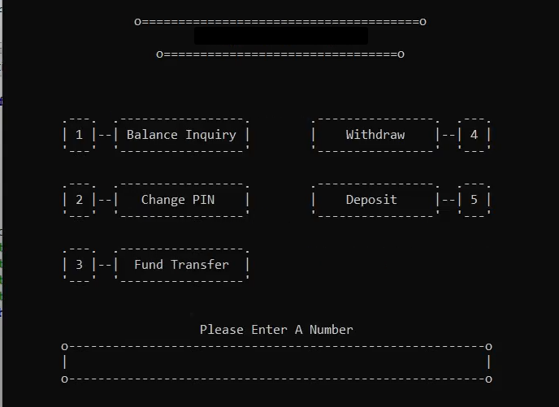

# ATM simulation
A terminal-based ATM simulation written in C++ (2023).

> [!WARNING]
> **Security Disclaimer:**  
> Credential protection is implemented via a custom substitution cipher (obfuscation) rather than industry-standard hashing. This project is a logic simulation and not intended for secure environments.

## Screenshots

